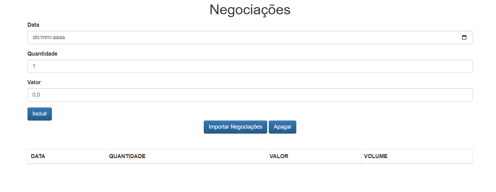

# JS Cangaceiro

Aprendizado com o livro o Cangaceiro Javascript de Flavio Almeida. 12/2022 

[🔗 Clique aqui para acessar] (https://michel-maia.github.io/JS-Cangaceiro/)

## 💻 Tecnologias

- HTML
- CSS
- JavaScript 

## Referência

- [Livro] [Cangaceiro JavaScript - Uma aventura no sertão da programação - Flavio Almeida]
 
